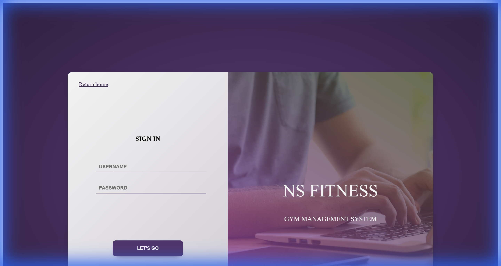
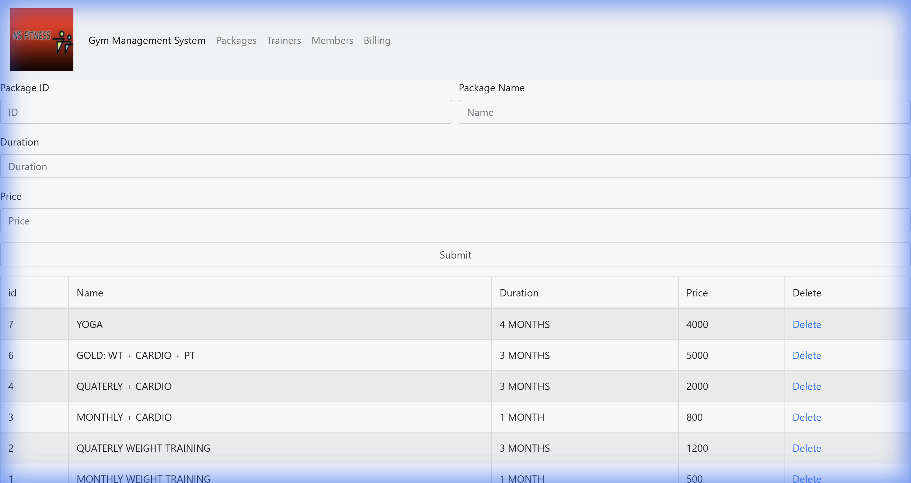
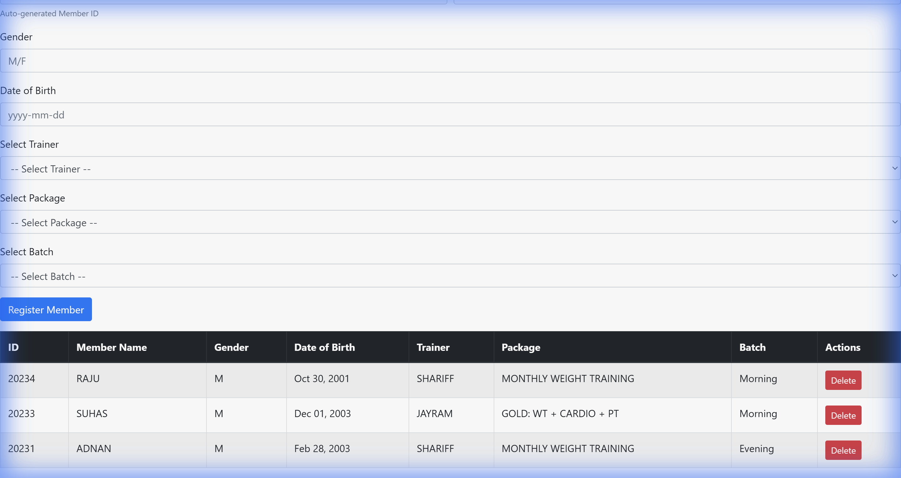
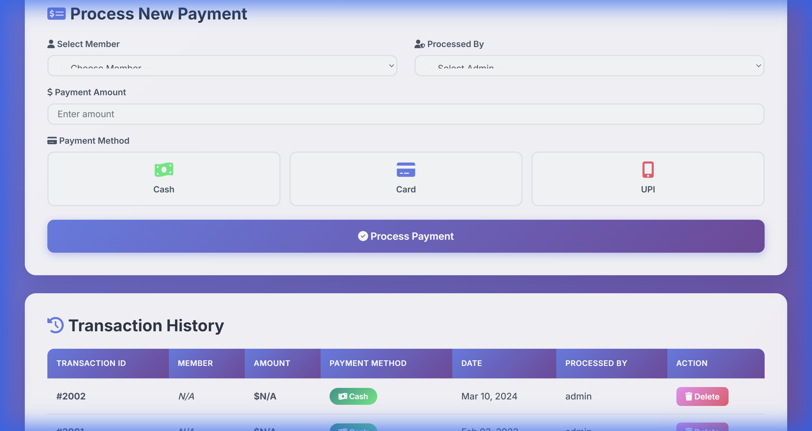

# 💪 Gym Management System

<div align="center">


**A modern, full-featured gym management system with beautiful UI and powerful features**

[Features](#-features) • [How to Run](#-how-to-run-the-project) • [Screenshots](#-screenshots) • [Tech Stack](#-tech-stack)

</div>

---

## 📋 Overview

The **Gym Management System** is a comprehensive web-based application designed to streamline gym operations. Built with PHP and MySQL, it features a modern, aesthetic interface with gradient designs, interactive elements, and smart automation.

---

## 🚀 How to Run the Project

### Prerequisites
Before you begin, ensure you have:
- ✅ **XAMPP** installed (includes Apache, MySQL, PHP)
- ✅ A modern web browser (Chrome, Firefox, Edge)
- ✅ Basic knowledge of running local servers

### Step 1: Install XAMPP
1. Download XAMPP from [https://www.apachefriends.org/](https://www.apachefriends.org/)
2. Install XAMPP on your computer
3. Remember the installation directory (usually `C:\xampp` on Windows)

### Step 2: Get the Project Files
1. Download or clone this repository
2. Copy the entire project folder to `C:\xampp\htdocs\`
3. The path should be: `C:\xampp\htdocs\Gym-Management-System-DBMS\`

### Step 3: Start XAMPP Services
1. Open **XAMPP Control Panel**
2. Click **Start** next to **Apache**
3. Click **Start** next to **MySQL**
4. Both should show green "Running" status

### Step 4: Create the Database
1. Open your browser and go to: `http://localhost/phpmyadmin`
2. Click **New** in the left sidebar
3. Enter database name: `nsfitness`
4. Click **Create**

### Step 5: Import Database Tables
1. Click on the `nsfitness` database you just created
2. Click the **Import** tab at the top
3. Click **Choose File**
4. Navigate to your project folder and select `nsfitness.sql`
5. Scroll down and click **Import**
6. You should see "Import has been successfully finished"

### Step 6: Access the Application
Open your browser and navigate to:

**Homepage:**
```
http://localhost/Gym-Management-System-DBMS/index.html
```

**Admin Login:**
```
http://localhost/Gym-Management-System-DBMS/admin-login.php
```

### Step 7: Login
Use these credentials to access the admin panel:
- **Username:** `admin`
- **Password:** `password`

---

## 🎯 Quick Start Guide

Once logged in, you can access:

1. **📦 Packages** → Manage membership plans
2. **👨‍🏫 Trainers** → Manage gym trainers
3. **👥 Members** → Register and manage members
4. **💳 Billing** → Process payments and view transactions

---

## 📸 Screenshots

### 🔐 Login Page

*Secure admin authentication with beautiful gradient design*

### 📦 Packages Management

*Create and manage membership packages with real-time statistics*

### 👨‍🏫 Trainers Management

*Manage gym trainers with gender statistics and member assignments*

### 👥 Members Management

*Register members with auto-generated IDs and batch tracking*

### 💳 Billing & Payments

*Process payments with interactive payment methods and auto-fill*

---

## ✨ Features

### 🔐 **Admin Authentication**
- Secure login system for administrators
- Beautiful gradient login page with modern design
- Session management for secure access

### 📦 **Package Management**
- Create and manage membership packages
- Set duration and pricing
- Track which members use each package
- Real-time statistics dashboard
- Delete packages with confirmation dialogs

### 👨‍🏫 **Trainer Management**
- Add trainers with detailed profiles
- Track experience and qualifications
- Assign trainers to members
- Gender-based statistics
- Automatic age calculation
- Prevent deletion of trainers with active members

### 👥 **Member Management**
- Auto-generated unique member IDs
- Register members with complete details
- Assign trainers and packages via dropdown
- Track member information and status
- Batch management (Morning/Evening)
- View all members in an organized table

### 💳 **Billing & Payments** ⭐ *Premium Feature*
- **Modern Dashboard**: Real-time statistics and insights
- **Smart Member Selection**: Choose members from dropdown
- **Auto-Fill Amounts**: Automatically populates package price
- **Interactive Payment Methods**: Visual cards for Cash, Card, UPI
- **Transaction History**: Color-coded badges and detailed records
- **Beautiful UI**: Gradient backgrounds and smooth animations

---

## 🛠️ Tech Stack

### Backend
- **PHP 7.4+** - Server-side logic
- **MySQL/MariaDB** - Database management
- **mysqli** - Database connectivity

### Frontend
- **HTML5** - Structure
- **CSS3** - Custom styling with gradients
- **Bootstrap 4.6** - Responsive framework
- **JavaScript/jQuery** - Interactive features
- **Font Awesome 6** - Icon library
- **Google Fonts (Inter)** - Typography

### Design Features
- Gradient backgrounds
- Glass morphism effects
- Smooth animations
- Responsive grid layouts
- Color-coded badges
- Interactive hover effects

---

## 📊 Database Schema

The system uses 5 main tables:

### `admin`
- Stores admin credentials
- Fields: id, username, password

### `members`
- Stores member information
- Fields: id, name, gender, dob, trainer_id, package_id, batch, transaction_id

### `packages`
- Stores membership packages
- Fields: id, name, duration, price

### `trainers`
- Stores trainer information
- Fields: id, name, dob, gender, experience

### `transaction`
- Stores payment transactions
- Fields: transaction_id, admin_id, mode, date

---

## 🎨 Design Highlights

### Color Palette
- **Primary Gradient:** Purple to Violet (#667eea → #764ba2)
- **Success Gradient:** Teal to Green (#11998e → #38ef7d)
- **Warning Gradient:** Pink to Red (#f093fb → #f5576c)
- **Info Gradient:** Blue to Cyan (#4facfe → #00f2fe)

### Typography
- **Font Family:** Inter (Google Fonts)
- **Weights:** 300, 400, 500, 600, 700

### Components
- **Cards:** 20px border radius, glass morphism
- **Buttons:** Gradient backgrounds with hover animations
- **Tables:** Purple gradient headers with hover effects
- **Badges:** Color-coded with icons

---

## 🔧 Troubleshooting

### ❌ "Database connection error"
**Solution:**
- Ensure MySQL is running in XAMPP
- Check that database name is `nsfitness`
- Verify credentials in `config.php`

### ❌ "Page not found" or "404 error"
**Solution:**
- Ensure Apache is running in XAMPP
- Check that project is in `C:\xampp\htdocs\Gym-Management-System-DBMS\`
- Use correct URL: `http://localhost/Gym-Management-System-DBMS/`

### ❌ "Import failed" when importing SQL
**Solution:**
- Ensure you selected the correct `nsfitness.sql` file
- Check that database `nsfitness` is created first
- Try importing again

### ❌ Forms not submitting
**Solution:**
- Check browser console for JavaScript errors
- Ensure all required fields are filled
- Verify database connection is active

---

## 📝 Default Data

The system comes with sample data:

### Sample Packages
- Monthly Weight Training - ₹500
- Quarterly Weight Training - ₹1200
- Monthly + Cardio - ₹800
- Quarterly + Cardio - ₹2000
- Gold: WT + Cardio + PT - ₹5000

### Sample Trainers
- Shariff (Male, 2 years experience)
- Jayram (Male, 5 years experience)
- Ranjita (Female, 2 years experience)

### Sample Members
- Multiple registered members with assigned trainers and packages

---

## 🎯 Usage Examples

### Register a New Member
1. Go to **Members** page
2. Fill in member details (ID is auto-generated)
3. Select trainer from dropdown
4. Select package from dropdown
5. Choose batch (Morning/Evening)
6. Click "Register Member"

### Process a Payment
1. Go to **Billing** page
2. Select member from dropdown (amount auto-fills!)
3. Select admin processing the payment
4. Choose payment method (Cash/Card/UPI)
5. Click "Process Payment"

### Add a Package
1. Go to **Packages** page
2. Enter package ID, name, duration, and price
3. Click "Add Package"

---

## 🌐 Project URLs

Once running, access these pages:

| Page | URL |
|------|-----|
| Homepage | `http://localhost/Gym-Management-System-DBMS/index.html` |
| Admin Login | `http://localhost/Gym-Management-System-DBMS/admin-login.php` |
| Packages | `http://localhost/Gym-Management-System-DBMS/packages.php` |
| Trainers | `http://localhost/Gym-Management-System-DBMS/trainers.php` |
| Members | `http://localhost/Gym-Management-System-DBMS/members.php` |
| Billing | `http://localhost/Gym-Management-System-DBMS/transaction.php` |
| phpMyAdmin | `http://localhost/phpmyadmin` |

---

## 🔒 Security Notes

> ⚠️ **Important:** This is a development/educational project

- Change default admin credentials before production use
- Implement password hashing (currently plain text)
- Add input sanitization for production
- Use prepared statements to prevent SQL injection
- Enable HTTPS in production

---

## 📈 Future Enhancements

- [ ] Member attendance tracking
- [ ] Automated payment reminders
- [ ] Email notifications
- [ ] Reports and analytics
- [ ] Mobile app integration
- [ ] QR code member cards
- [ ] Inventory management
- [ ] Staff scheduling

---

## 👨‍💻 Developer

**Project:** Gym Management System  
**Version:** 2.0  
**Last Updated:** January 2026

---

## 📄 License

This project is open source and available for educational purposes.

---

## 🙏 Acknowledgments

- Bootstrap for the responsive framework
- Font Awesome for beautiful icons
- Google Fonts for typography
- XAMPP for the development environment

---

<div align="center">

**Made with ❤️ for Gym Owners Everywhere**

⭐ Star this repo if you find it useful!

</div>
